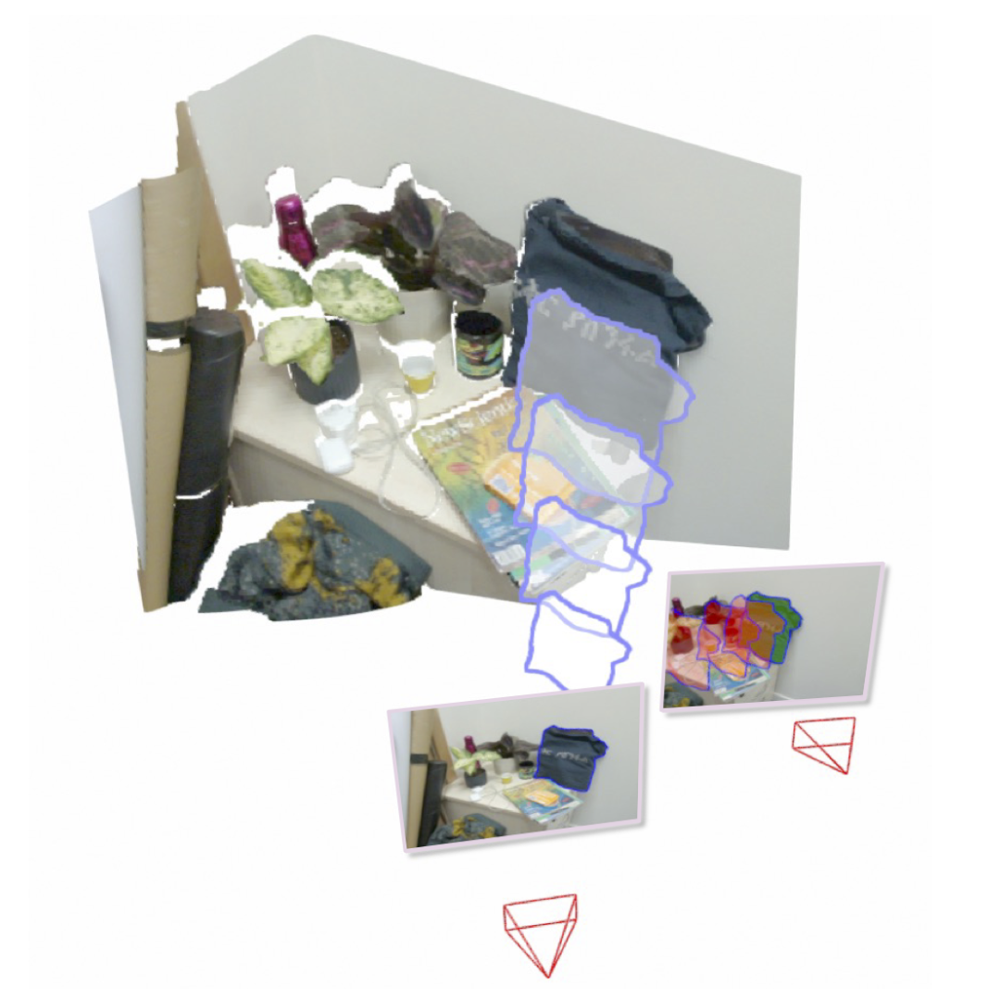

<p align="center">

  <h1 align="center"> <b>SuperPrimitive:</b> Scene Reconstruction at a Primitive Level
  </h1>
  <p align="center">
    <a href="https://makezur.github.io/"><strong>Kirill Mazur</strong></a>
    ·
    <a href="https://www.baegwangbin.com/"><strong>Gwangbin Bae</strong></a>
    ·
    <a href="https://www.doc.ic.ac.uk/~ajd/"><strong>Andrew J. Davison</strong></a>
  </p>
  <h3 align="center">CVPR 2024</h3>

</p>

[comment]: <> (  <h2 align="center">PAPER</h2>)
<h3 align="center"><a href="https://arxiv.org/abs/2312.05889">Paper</a> | <a href="https://youtu.be/hKYgAf6MoB8">Video</a> | <a href="https://makezur.github.io/SuperPrimitive/">Project Page</a></h3>
  <div align="center"></div>

<p align="center">
  <a href="">
    
  </a>
</p> 

# Getting Started
## Installation
```shell
git clone https://github.com/makezur/super_primitive.git --recursive
cd super_primitive
```
Setup the environment by running our installation script:
```shell
source install.sh
```
Note that the provided software was tested on Ubuntu 20.04 with a single Nvidia RTX 4090.

## Downloading Checkpoints and Data

To download the required checkpoints and datasets, please run our download script:
```shell
bash ./download.sh
```

The script will download the pre-trained checkpoints for both SAM and surface normal estimation networks. A replica scene and TUM_fr1 sequences will also be downloaded and unpacked automatically. 

**N.B.** in case of the system CUDA version mismatch you might have to change the ```pytorch-cuda``` version in the installation script.

# Running Demo (Structure-from-Motion)
Run the following script for a minimal example of our SuperPrimitive-based joint pose and geometry estimation. Here, we estimate a relative pose between two frames and the depth of the source frame. 

```shell
python sfm_gui_runner.py --config config/replica_sfm_example.yaml
```

# Monocular Visual Odometry (TUM)
Run our MonoVO on a TUM sequence by executing the following command:
```shell
python sfm_gui_runner.py --config config/tum/odom_desk.yaml --odom
```
## Evaluation 

We provide a tool to convert estimated trajectories into the TUM format.

Conversion and subsequent evaluation of the $Sim(3)$-aligned absolute trajectory error (ATE) can be done with the following commands:
```bash
python convert_traj_to_tum.py --root results/desk_undistort_fin_TIMESTAMP
cd results/desk_undistort_fin_TIMESTAMP
evo_ape tum converted_gt_tum_traj.txt converted_tum_traj.txt -as --plot --plot_mode xy --save_results ./res.zip
```

# Depth Completion (VOID)
To download VOID please follow [the official instructions](https://github.com/alexklwong/void-dataset#downloading-void).

Please run this script to reproduce the quantitative evaluation of the SuperPrimitive-based depth completion described in the paper:
```shell
python evaluate_void.py --dataset PATH_TO_VOID_DATASET
```

# Acknowledgments
Our code draws a lot from the [DepthCov](https://github.com/edexheim/DepthCov) codebase and we want to give a special thanks to its author. 

We additionally thank the authors of the following codebases that made our project possible:

* [Bilateral Normal Integration](https://github.com/xucao-42/bilateral_normal_integration)
* [Estimating and Exploiting the Aleatoric Uncertainty in Surface Normal Estimation](https://github.com/baegwangbin/surface_normal_uncertainty)
* [Segment Anything](https://github.com/facebookresearch/segment-anything)

# Citation 
If you found our code/work useful, please consider citing our publication:

```bib 
@inproceedings{Mazur:etal:CVPR2024,
title={{SuperPrimitive}: Scene Reconstruction at a Primitive Level},
author={Kirill Mazur and Gwangbin Bae and Andrew Davison},
booktitle={IEEE/CVF Conference on Computer Vision and Pattern Recognition (CVPR)},
year={2024},
}
```